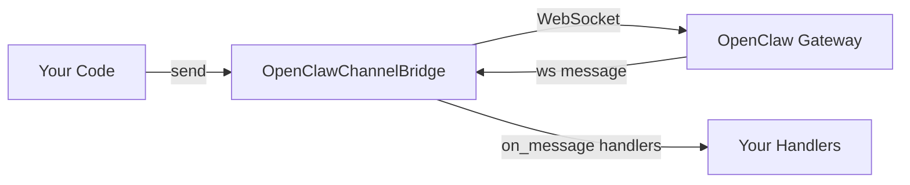

# Channels

The channels module lets OpenJarvis send and receive messages through external messaging gateways. The primary implementation connects to the OpenClaw gateway over WebSocket, with automatic HTTP fallback when WebSocket is unavailable.

!!! note "Channels are disabled by default"
    The `[channel]` config section defaults to `enabled = false`. You must set `enabled = true` and configure a `gateway_url` before channel features become active.

---

## Overview

Channel messaging is built around a simple abstraction: a `BaseChannel` connects to a gateway, registers handlers for incoming messages, and sends outgoing messages by name. The `OpenClawChannelBridge` is the bundled implementation that speaks to the OpenClaw gateway.



---

## OpenClawChannelBridge

`OpenClawChannelBridge` is registered as `"openclaw"` in `ChannelRegistry` and connects to the OpenClaw gateway over WebSocket. If the `websockets` package is not installed, it falls back to HTTP automatically.

### Connecting

```python title="connect.py"
from openjarvis.channels.openclaw_bridge import OpenClawChannelBridge

bridge = OpenClawChannelBridge(
    gateway_url="ws://127.0.0.1:18789/ws",  # (1)!
    reconnect_interval=5.0,                  # (2)!
)
bridge.connect()

print(bridge.status())  # ChannelStatus.CONNECTED
```

1. Defaults to the locally running OpenClaw gateway. Override to point at a remote gateway.
2. Seconds to wait before attempting reconnection after a disconnect.

### Sending Messages

```python title="send_message.py"
from openjarvis.channels.openclaw_bridge import OpenClawChannelBridge

bridge = OpenClawChannelBridge()
bridge.connect()

# Send to a named channel
ok = bridge.send(
    "user-notifications",
    "Analysis complete. Results are ready.",
    conversation_id="conv-abc123",  # optional, for threading
)

if ok:
    print("Message delivered")
else:
    print("Delivery failed")

bridge.disconnect()
```

### Receiving Messages

Register handler callbacks before calling `connect()`. Each handler receives a `ChannelMessage` and can optionally return a reply string.

```python title="receive_messages.py"
from openjarvis.channels._stubs import ChannelMessage
from openjarvis.channels.openclaw_bridge import OpenClawChannelBridge

bridge = OpenClawChannelBridge()


def handle_incoming(msg: ChannelMessage) -> None:
    print(f"[{msg.channel}] {msg.sender}: {msg.content}")
    print(f"  conversation_id={msg.conversation_id}")
    print(f"  message_id={msg.message_id}")


bridge.on_message(handle_incoming)  # (1)!
bridge.connect()                    # (2)!

# Messages now arrive asynchronously via the background listener thread
# Your main thread can continue doing other work
```

1. Register one or more handlers. All registered handlers are called for every incoming message.
2. `connect()` starts the background listener thread after establishing the WebSocket connection.

### Listing Available Channels

```python title="list_channels.py"
from openjarvis.channels.openclaw_bridge import OpenClawChannelBridge

bridge = OpenClawChannelBridge()
# No need to call connect() — list_channels() uses HTTP directly
channels = bridge.list_channels()
print(channels)  # ["user-notifications", "system-alerts", "chat"]
```

### Disconnecting

```python title="disconnect.py"
bridge.disconnect()
# Stops the listener thread and closes the WebSocket connection
# Status becomes ChannelStatus.DISCONNECTED
```

---

## ChannelMessage Fields

Every incoming message is delivered to handlers as a `ChannelMessage` dataclass.

| Field | Type | Description |
|-------|------|-------------|
| `channel` | `str` | Name of the channel the message arrived on |
| `sender` | `str` | Identifier of the message sender |
| `content` | `str` | Message text |
| `message_id` | `str` | Unique message identifier (may be empty) |
| `conversation_id` | `str` | Thread/conversation identifier (may be empty) |
| `metadata` | `dict[str, Any]` | Additional metadata from the gateway |

---

## WebSocket and HTTP Fallback

`OpenClawChannelBridge` tries WebSocket first and falls back to HTTP transparently:

| Transport | When Used | Notes |
|-----------|-----------|-------|
| WebSocket (`websockets` library) | `websockets` package is installed and gateway is reachable | Enables real-time push delivery via background listener thread |
| HTTP fallback (`httpx`) | `websockets` not installed, or WebSocket send fails | `send()` uses `POST /send`; `list_channels()` uses `GET /channels`. No push delivery. |

!!! warning "Receiving messages requires WebSocket"
    The `on_message` handler system is powered by the WebSocket listener thread. If you are running in HTTP fallback mode, incoming messages are not delivered to handlers. You must poll `list_channels()` or use a different mechanism to receive messages.

### Checking Which Transport Is Active

```python
bridge = OpenClawChannelBridge()
bridge.connect()

# If ws is None, we are in HTTP fallback mode
if bridge._ws is None:
    print("Running in HTTP fallback mode")
else:
    print("Connected via WebSocket")
```

---

## Event Bus Integration

Pass an `EventBus` to publish channel events to the rest of the system:

```python title="channel_events.py"
from openjarvis.core.events import EventBus, EventType
from openjarvis.channels.openclaw_bridge import OpenClawChannelBridge

bus = EventBus()


def on_received(event):
    print(f"Message received on {event.data['channel']}: {event.data['content']}")


def on_sent(event):
    print(f"Message sent to {event.data['channel']}")


bus.subscribe(EventType.CHANNEL_MESSAGE_RECEIVED, on_received)
bus.subscribe(EventType.CHANNEL_MESSAGE_SENT, on_sent)

bridge = OpenClawChannelBridge(bus=bus)
bridge.connect()
```

| Event | Published When | Data Keys |
|-------|----------------|-----------|
| `CHANNEL_MESSAGE_RECEIVED` | A message arrives from the gateway | `channel`, `sender`, `content`, `message_id` |
| `CHANNEL_MESSAGE_SENT` | A message is successfully sent | `channel`, `content`, `conversation_id` |

---

## Reconnect Behavior

The listener thread handles disconnects automatically:

1. If `_ws.recv()` raises an exception (network drop, server restart), the thread logs a warning.
2. The bridge waits `reconnect_interval` seconds (default: 5.0).
3. It attempts to re-establish the WebSocket connection.
4. If reconnection succeeds, message delivery resumes. If it fails, the bridge enters `ChannelStatus.ERROR` and the thread tries again on the next iteration.

Calling `disconnect()` sets a stop event that causes the listener thread to exit cleanly without waiting for a reconnect cycle.

---

## CLI Commands

The `jarvis channel` subcommand group provides quick access to channel operations.

### List Channels

```bash
# Use the gateway URL from config
jarvis channel list

# Override the gateway URL
jarvis channel list --gateway ws://192.168.1.100:18789/ws
```

### Send a Message

```bash
# Send to a channel by name
jarvis channel send user-notifications "Build completed successfully"

# With a custom gateway URL
jarvis channel send alerts "Disk usage exceeded 90%" --gateway ws://myserver:18789/ws
```

### Show Status

```bash
# Show connection status for the configured gateway
jarvis channel status

# Check a specific gateway
jarvis channel status --gateway ws://192.168.1.100:18789/ws
```

Example output:

```
Gateway: ws://127.0.0.1:18789/ws
Status: connected
```

---

## API Server Endpoints

When `jarvis serve` is running, three channel endpoints are available. The channel bridge must be configured and enabled in `[channel]` for these endpoints to return data.

### `GET /v1/channels`

Returns the list of available channels and the current bridge status.

```bash
curl http://localhost:8000/v1/channels
```

```json
{
  "channels": ["user-notifications", "system-alerts"],
  "status": "connected"
}
```

If the bridge is not configured:
```json
{"channels": [], "message": "Channel bridge not configured"}
```

### `POST /v1/channels/send`

Send a message to a channel.

```bash
curl -X POST http://localhost:8000/v1/channels/send \
  -H "Content-Type: application/json" \
  -d '{"channel": "user-notifications", "content": "Hello!", "conversation_id": "conv-1"}'
```

```json
{"status": "sent", "channel": "user-notifications"}
```

Required fields: `channel`, `content`. `conversation_id` is optional.

### `GET /v1/channels/status`

Returns the bridge connection status string.

```bash
curl http://localhost:8000/v1/channels/status
```

```json
{"status": "connected"}
```

Possible values: `connected`, `disconnected`, `connecting`, `error`, `not_configured`.

---

## Configuration

Channel settings live in the `[channel]` section of `~/.openjarvis/config.toml`.

```toml title="~/.openjarvis/config.toml"
[channel]
enabled = true
gateway_url = "ws://127.0.0.1:18789/ws"
default_agent = "simple"
reconnect_interval = 5.0
```

### Configuration Reference

| Key | Type | Default | Description |
|-----|------|---------|-------------|
| `enabled` | `bool` | `false` | Enable channel messaging |
| `gateway_url` | `str` | `ws://127.0.0.1:18789/ws` | WebSocket URL of the OpenClaw gateway |
| `default_agent` | `str` | `simple` | Agent to use for handling inbound messages |
| `reconnect_interval` | `float` | `5.0` | Seconds between reconnection attempts |

---

## Complete Example

This example connects to the OpenClaw gateway, registers a handler that echoes messages back, sends a test message, and then disconnects after a short wait.

```python title="full_example.py"
import time
import threading
from openjarvis.channels._stubs import ChannelMessage
from openjarvis.channels.openclaw_bridge import OpenClawChannelBridge
from openjarvis.core.events import EventBus

bus = EventBus()
bridge = OpenClawChannelBridge(
    gateway_url="ws://127.0.0.1:18789/ws",
    reconnect_interval=5.0,
    bus=bus,
)

received_messages = []


def on_message(msg: ChannelMessage) -> None:
    received_messages.append(msg)
    print(f"Received from {msg.sender} on #{msg.channel}: {msg.content}")


bridge.on_message(on_message)
bridge.connect()

# List available channels
channels = bridge.list_channels()
print(f"Available channels: {channels}")

# Send a message
if channels:
    bridge.send(channels[0], "Hello from OpenJarvis!")

# Wait for incoming messages
time.sleep(10)

bridge.disconnect()
print(f"Total messages received: {len(received_messages)}")
```

---

## See Also

- [Architecture: Channels](../architecture/channels.md) — listener loop internals and reconnect design
- [API Reference: Channels](../api/channels.md) — full class and type signatures
- [Getting Started: Configuration](../getting-started/configuration.md) — full config reference
- [OpenClaw Agent](agents.md) — the agent infrastructure that uses OpenClaw transport
